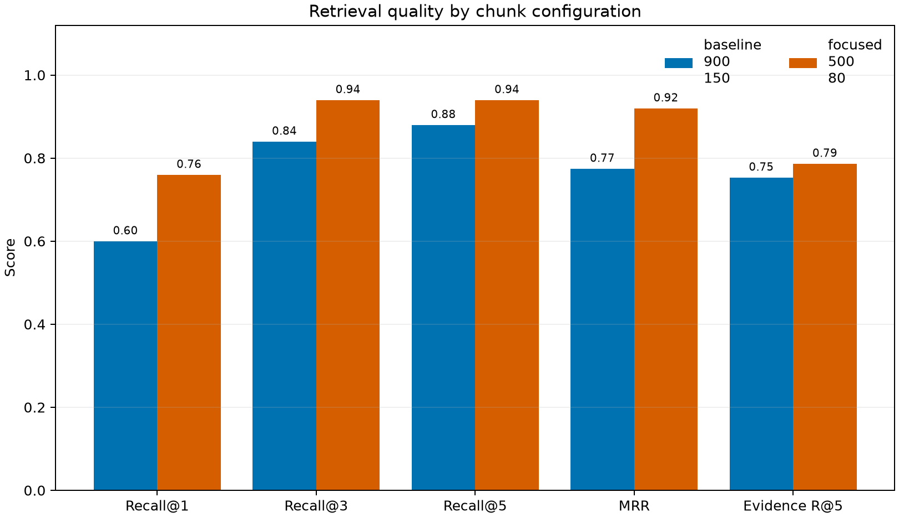
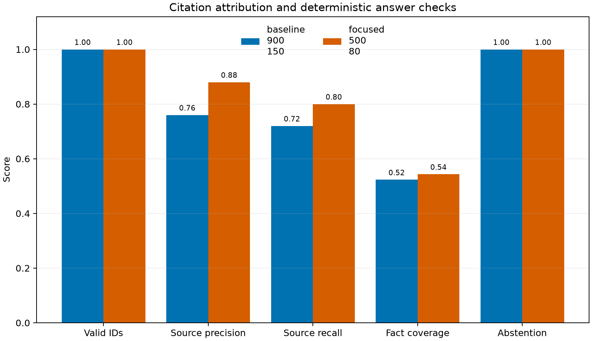
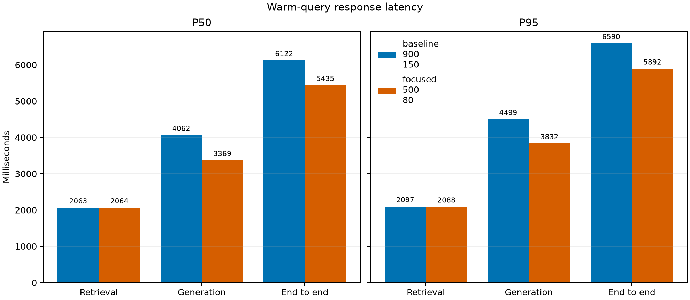

# RAG Evaluation Results

Reference run `meridian-v1-20260716T175543Z-c3a8dabf` evaluated 30 golden questions (25 answerable) over 8 version-controlled documents.

## Summary

| Configuration | Recall@1 | Recall@3 | Recall@5 | MRR | Citation source recall | Fact coverage | End-to-end p50 (ms) |
|---|---|---|---|---|---|---|---|
| baseline_900_150 | 0.600 | 0.840 | 0.880 | 0.775 | 0.720 | 0.523 | 6121.5 |
| focused_500_80 | 0.760 | 0.940 | 0.940 | 0.920 | 0.800 | 0.543 | 5435.0 |

## Measured comparison

- Focused `500/80` increased Recall@1 from 0.60 to 0.76, Recall@5 from
  0.88 to 0.94, and MRR from 0.775 to 0.920 on the 25 answerable questions.
- Evidence Recall@5 moved more modestly, from 0.753 to 0.787. The smaller gain
  confirms that retrieving the expected document does not always retrieve the
  expected passage.
- Citation source precision increased from 0.76 to 0.88 and source recall from
  0.72 to 0.80. Both configurations had a 1.00 valid-ID rate, but citation
  presence decreased from 0.92 to 0.88, so valid syntax should not be presented
  as universal citation coverage.
- Required-fact coverage changed only from 0.523 to 0.543. Both configurations
  correctly abstained on all five unanswerable questions under the documented
  heuristic.
- End-to-end p50 decreased from 6122 ms to 5435 ms (11.2%), and p95 decreased
  from 6590 ms to 5892 ms (10.6%). Retrieval p50 remained approximately 2063 ms;
  the measured difference came from generation p50, which decreased from 4062
  ms to 3369 ms. This is consistent with the focused configuration supplying
  shorter context, but one ordered run does not establish a general latency law.

See [the reviewed failure analysis](error_analysis.md) for document misses,
passage misses, multi-source crowding, citation misattribution, generation
failures, and deterministic-metric blind spots observed in individual rows.

## Methodology

Both configurations used the same corpus, questions, `nomic-embed-text:latest`
embedding model, `qwen2.5:7b-instruct-q4_K_M` generation model, prompt, cosine
distance, retrieval depth, temperature, seed, 8,192-token context window, and
256-token response cap. Only chunk size and overlap changed. Each configuration
was indexed into a fresh run-specific Chroma store.

Retrieval metrics are calculated only for answerable questions. Citation metrics parse the generated `[S#]` markers and map them back to ranked retrieved chunks. Required-fact coverage is deterministic normalized phrase matching and is an answer-quality proxy, not a semantic correctness judgment. Latencies use wall-clock measurements after an excluded warm-up query for each configuration.

The recorded environment was Python 3.12.13, Ollama 0.11.5, and an NVIDIA
GeForce RTX 4080. Exact model digests, package versions, hashes, git state, and
hardware details are preserved in `run_manifest.json`. Baseline indexing ran
first and therefore included the embedding model's initial load; ingestion
times are recorded for reproducibility but are not used as a comparative claim.

## Artifact map

- `per_question.jsonl`: ranked hits, generated answers, metrics, timings, and model metadata
- `summary.json` and `summary.csv`: aggregate results
- `run_manifest.json`: versions, hashes, models, hardware, and configuration
- `error_analysis.md`: manually reviewed representative failures, added after the run

## Limitations

- The corpus is deliberately small and project-authored; results do not generalize to arbitrary domains.
- One measured generation per question limits latency-distribution confidence.
- Exact phrase checks under-credit valid paraphrases and can reward superficial lexical matches.
- Citation-source checks verify attribution targets, not whether every generated claim is entailed.
- The comparison isolates chunk geometry; it does not evaluate reranking or alternate embedding models.
