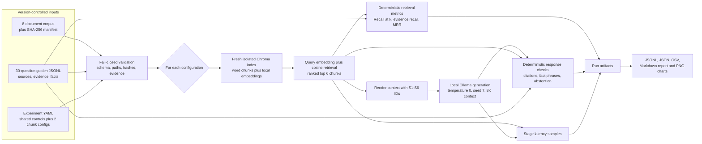

# Evaluation architecture

The V1 evaluator is a deliberately narrow local pipeline. Checked-in ground
truth is validated before any model call, every retrieval configuration receives
a fresh Chroma index, and measured outputs retain enough context to audit a
claim back to its question, retrieved chunks, environment, and input hashes.

## Isolation and reproducibility

The experiment loop holds corpus, question set, prompt, top-k, models,
temperature, seed, and distance metric constant. Only chunk size and overlap
change. Indexes live at `.eval_cache/<run-id>/<experiment-id>/`; they are created
fresh and never reuse the interactive `storage/` collection or another
configuration's vectors.

The runner performs one excluded warm-up query per configuration before the 30
measured questions. It records embedding, vector-search, combined retrieval,
generation, and end-to-end wall-clock time. The run manifest captures the git
state, input and prompt hashes, package versions, hardware, Ollama version, and
resolved model digests. A completed manifest is the boundary between configured
intent and reportable measurement.

## Trust boundaries

- Corpus files, the manifest, and golden labels are trusted only after strict
  local validation. Paths may not escape the corpus directory, hashes must
  match, and evidence anchors must occur verbatim in their declared source.
- Ollama is a separate local process reached over loopback HTTP. Prompts and
  corpus chunks cross that process boundary, but the configured evaluator does
  not send them to a paid or hosted model API.
- Chroma persists run-local vectors on disk with anonymized telemetry disabled.
  Temporary evaluation indexes are ignored by Git; selected result artifacts
  can be reviewed and versioned separately.
- Model output is untrusted experimental data. Citation parsing and phrase
  checks measure narrow observable properties; neither establishes semantic
  entailment.
- The run artifact directory can contain corpus excerpts, questions, answers,
  model metadata, local paths, git status, and hardware details. Review it
  before publishing, even when the source corpus itself is public.
- The optional web UI loads JavaScript from `unpkg.com` and defaults to a network
  bind when started without options. Use `--host 127.0.0.1` for a local-only
  interface. The CLI evaluation path does not depend on the browser CDN.

## Failure behavior

Validation errors stop execution before indexing. During execution, a failure
marks the run manifest as failed when the manifest has already been created;
partial files are diagnostic evidence, not results. Aggregate summaries,
reports, and charts are emitted only after every configured experiment finishes.
